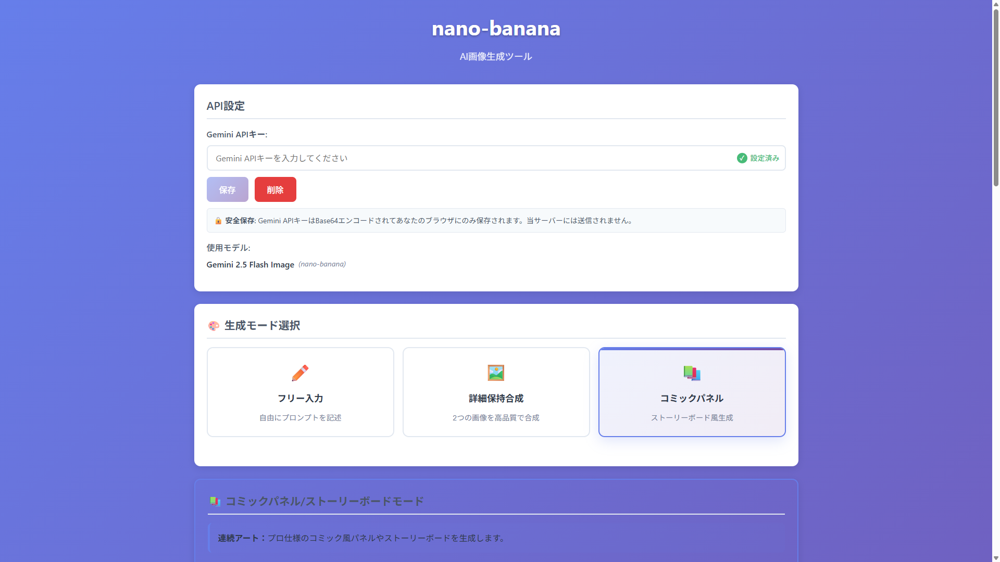

# nano-banana

<div align="center">



</div>

シンプルで確実に動作するAI画像生成ツール。Gemini 2.5 Flash Image APIを使用してテキストプロンプトから高品質な画像を生成します。

## 🚀 主要機能

### 🔑 API設定
- **APIキー管理**: Gemini APIキーの設定・保存
- **設定状態表示**: APIキー設定済みの視覚的確認
- **安全な保存**: LocalStorageでのBase64エンコード保存

### 🎨 3つの生成モード
- **フリー入力**: 従来の自由なプロンプト入力モード
- **詳細保持合成 (Template 5)**: 2つの画像を高品質で合成
- **コミックパネル (Template 6)**: プロ仕様のストーリーボード生成

### 🖼️ 詳細保持合成モード（公式Template 5）
- **高忠実度保持**: 第1画像の特徴を完全に保持
- **自然統合**: 第2画像の要素を自然に統合
- **リアルタイムプレビュー**: 生成プロンプトをリアルタイム表示
- **プロ品質**: 公式テンプレート完全準拠

### 📚 コミックパネルモード（公式Template 6）
- **6種類のアートスタイル**: ノワール、マンガ、水彩など選択可能
- **詳細設定**: 前景・背景・テキスト・ムード・アスペクト比設定
- **ストーリーボード**: プロ仕様のコミック風パネル生成
- **リアルタイムプレビュー**: 構成された完全なプロンプト表示

### ✏️ プロンプト入力
- **大容量対応**: 5000文字以内での詳細な説明入力
- **プロンプト履歴**: 過去のプロンプトから選択・再利用
- **公式サンプル**: 6種類の公式推奨プロンプトとコツ表示
- **リアルタイム文字数表示**: 入力中の文字数確認

### 🎨 画像生成・管理
- **Gemini 2.5 Flash Image API**: Google最新の画像生成AI
- **複数サイズ対応**: 正方形、横長、縦長など5種類
- **参考画像対応**: 最大2枚の参考画像アップロード
- **高品質出力**: テキストプロンプトから高解像度画像を生成
- **再生成機能**: 同じプロンプトでバリエーション生成

### 💾 画像管理
- **ダウンロード機能**: 生成画像をPNG形式で保存
- **自動ファイル名**: タイムスタンプ付きファイル名の自動生成
- **エラーハンドリング**: 詳細なエラーメッセージと対処法の表示

## 🛠️ 技術仕様

### フロントエンド
- **HTML5**: セマンティックな構造
- **CSS3**: モダンUI、レスポンシブデザイン
- **Vanilla JavaScript**: フレームワーク不使用、軽量実装

### API連携
- **Gemini 2.5 Flash Image**: Google製の最新画像生成AI
- **REST API**: 直接的なAPI呼び出し
- **ヘッダー認証**: x-goog-api-key ヘッダーによる認証

### セキュリティ
- **Content Security Policy**: XSS攻撃の防止
- **APIキー暗号化**: Base64エンコードによる安全な保存
- **入力検証**: プロンプトとAPIキーの形式チェック

## 🚀 使用方法

### 1. セットアップ
1. [Google AI Studio](https://makersuite.google.com/app/apikey)でAPIキーを取得
2. アプリケーションの「API設定」にキーを入力して保存
3. 「✓ 設定済み」バッジが表示されれば準備完了

### 2. 生成モードの選択
画面上部のタブから生成モードを選択：

**🎨 フリー入力モード**
1. **プロンプト入力**: 生成したい画像を詳しく説明
   - 例: "美しい夕焼けの海岸、波が静かに打ち寄せる風景"
2. **サイズ選択**: 画像のアスペクト比を選択
3. **参考画像**: 必要に応じて最大2枚アップロード
4. **生成開始**: 「画像を生成」ボタンをクリック

**🖼️ 詳細保持合成モード（Template 5）**
1. **参考画像アップロード**: 2枚の画像を必須でアップロード
2. **保持する要素**: 第1画像で保持したい特徴を記述
3. **追加する要素**: 第2画像から追加したい要素を記述
4. **統合方法**: どのように統合するかを詳細に記述
5. **プレビュー確認**: 生成されるプロンプトを確認
6. **生成開始**: 「詳細保持合成で生成」ボタンをクリック

**📚 コミックパネルモード（Template 6）**
1. **アートスタイル**: 6種類から選択（ノワール、マンガ、水彩など）
2. **前景設定**: メインキャラクターとアクションを記述
3. **背景設定**: 環境や設定を記述
4. **テキスト**: キャプションやセリフを入力（オプション）
5. **ムード**: ライティングと雰囲気を選択
6. **アスペクト比**: 横長、縦長、正方形から選択
7. **プレビュー確認**: 構成された完全なプロンプトを確認
8. **生成開始**: 「コミックパネルで生成」ボタンをクリック

### 3. 便利機能
- **プロンプト履歴**: 過去のプロンプトから選択・再利用
- **公式サンプル**: 効果的なプロンプトの書き方を学習
- **ダウンロード**: 生成画像をPNG形式で保存
- **再生成**: 同じプロンプトでバリエーション生成
- **設定管理**: APIキーのクリア・再設定

## 🖥️ ローカル実行

### 起動方法
```bash
# Python使用の場合
python3 -m http.server 8000

# Node.js使用の場合
npx serve .
```

ブラウザで `http://localhost:8000` にアクセス

## 📱 ブラウザ対応

### 対応ブラウザ
- **Chrome 90+**
- **Firefox 88+**
- **Safari 14+**
- **Edge 90+**

### モバイル対応
- **iOS Safari 14+**
- **Android Chrome 90+**
- **レスポンシブデザイン**対応

## 🔒 プライバシー・セキュリティ

### データ保護
- **ローカル保存**: APIキーはブラウザのLocalStorageにのみ保存
- **サーバー送信なし**: 当アプリのサーバーには一切送信されません
- **直接通信**: ブラウザ ⟷ Google AI のみの通信

### セキュリティ機能
- **XSS攻撃防止**: Content Security Policy (CSP) 設定
- **入力検証**: 悪意ある入力の検出と防止
- **エラー情報保護**: 機密情報を含まないエラーメッセージ

## 🛠️ 開発情報

### プロジェクト構造
```
/
├── index.html          # メインHTMLファイル
├── css/
│   └── style.css      # スタイルシート
├── js/
│   └── app.js         # メインJavaScriptファイル
├── manifest.json      # PWA設定
├── sw.js              # Service Worker（PWAキャッシュ機能）
├── png/               # 画像・スクリーンショット
│   └── app-screenshot.png
├── doc/               # ドキュメント
│   ├── requirements.md
│   ├── technical-specs.md
│   └── implementation-plan.md
├── backup/            # 旧版バックアップ
└── README.md
```

### 設計原則
- **シンプルファースト**: 最小限の機能で確実に動作
- **セキュリティ重視**: 安全なAPIキー管理
- **レスポンシブ**: 全デバイス対応
- **PWA対応**: インストール可能

## 🐛 トラブルシューティング

### よくある問題

#### 1. 「APIキーが正しくありません」エラー
- APIキーの形式を確認（AIzaSyで始まる39文字）
- Google AI Studioで新しいAPIキーを生成
- ブラウザのキャッシュをクリア

#### 2. 「画像生成に失敗しました」エラー
- インターネット接続を確認
- プロンプトが5000文字以内か確認
- しばらく時間をおいて再試行

#### 3. 画像が表示されない
- ブラウザがBase64画像に対応しているか確認
- 開発者ツールでコンソールエラーを確認

### ログの確認
ブラウザの開発者ツール（F12）でコンソールログを確認してください。

## 📄 ライセンス

このプロジェクトはMITライセンスの下で公開されています。

## 🙏 謝辞

- **Google Gemini**: 高品質な画像生成AI
- **Claude Code**: 開発アシスタント

---

**🤖 Generated with [Claude Code](https://claude.ai/code)**