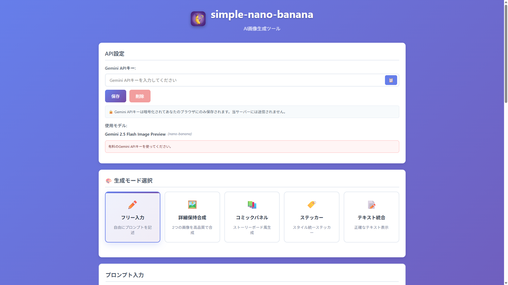

# 🍌 nano-banana - AI画像生成PWAアプリ



## 📌 概要

nano-bananaは、Google Gemini APIを使用した高品質な画像生成PWAアプリケーションです。シンプルなプロンプト入力から、Geminiの公式テンプレートを活用した高度な画像生成まで、多彩なモードで創造的な画像を生成できます。

### ✨ 主な特徴

- 🎨 **8つの生成モード** - フリーフォームから特殊テンプレートまで
- 📱 **PWA対応** - インストール可能、オフライン対応
- 🖼️ **参考画像アップロード** - 2枚までの参考画像で精度向上
- ✏️ **描画指示機能** - 画像に直接描画して詳細な指示
- 🌐 **自動翻訳** - 日本語プロンプトを自動で英語に翻訳
- 💎 **グラスモーフィズムUI** - 美しく洗練されたデザイン

## 🚀 デモ

[オンラインデモ](https://app008-simplenano-banana.vercel.app/)

## 📋 動作要件

- モダンブラウザ（Chrome, Firefox, Safari, Edge）
- Google Gemini API キー（無料取得可能）
- インターネット接続（画像生成時）

## 🛠️ セットアップ

### 1. Gemini APIキーの取得

1. [Google AI Studio](https://makersuite.google.com/app/apikey)にアクセス
2. 「Create API Key」をクリック
3. 生成されたAPIキーをコピー

### 2. ローカル環境での起動

```bash
# リポジトリのクローン
git clone https://github.com/takamiya1021/app008-simplenano-banana.git
cd app008-simplenano-banana

# HTTPサーバーの起動（Python 3）
python3 -m http.server 8000

# ブラウザでアクセス
# http://localhost:8000
```

### 3. APIキーの設定

1. アプリを開く
2. 「APIキー設定」セクションでAPIキーを入力
3. 「保存」ボタンをクリック

## 📖 使い方

### 生成モード一覧

#### 1. 🎨 フリーフォームモード
自由にプロンプトを入力して画像生成。最も柔軟な基本モード。

#### 2. 🔄 Template 5: 詳細保持合成モード
2つの参考画像の要素を組み合わせ、詳細を保持した合成画像を生成。

#### 3. 📚 Template 6: コミックパネルモード
プロ仕様のコミック風パネルやストーリーボードを生成。ジブリ風やドラゴンボール風など多彩なスタイル。

#### 4. 🏷️ Template 7: ステッカーモード
背景透明、輪郭強調されたステッカー画像を生成。Kawaii、Minimal、Pop、Hand-drawnスタイル対応。

#### 5. 📝 Template 8: テキスト統合モード
正確なテキスト表示を重視した画像生成。ポスター、ロゴ、看板、バナーなどに最適。

### 基本的な使い方

1. **モード選択**: 上部タブから生成モードを選択
2. **フォーム入力**: 各モードの入力欄に情報を記入
3. **画像生成**: 「生成」ボタンをクリック
4. **ダウンロード**: 生成された画像をダウンロード

### 高度な機能

#### 📷 参考画像アップロード
- 最大2枚の参考画像をアップロード可能
- ドラッグ&ドロップまたはクリックで選択
- 画像をAIが参考にして生成精度向上

#### ✏️ 描画指示機能
1. 参考画像をアップロード
2. 「描画モード」ボタンをクリック
3. 画像上に直接描画して指示
4. 色分けで異なる指示を追加
5. 描画した指示と共に画像生成

#### 🔄 自動翻訳機能
- 各モードのトグルスイッチでON/OFF
- 日本語プロンプトを自動で英語に翻訳
- より精度の高い画像生成を実現

## 🎨 デザイン特徴

- **グラスモーフィズム効果**: Template 5〜8で採用
- **レスポンシブデザイン**: モバイル/タブレット完全対応
- **PWAインストール**: ホーム画面に追加可能
- **オフライン対応**: Service Workerによるキャッシュ

## 🔧 技術スタック

- **Frontend**: HTML5, CSS3, Vanilla JavaScript
- **API**: Google Gemini 2.5 Flash Image API
- **PWA**: Service Worker, Web App Manifest
- **デザイン**: グラスモーフィズム, レスポンシブ設計

## 📊 API利用制限

Gemini APIの無料プランの制限：
- 15 RPM（リクエスト/分）
- 1,500 RPD（リクエスト/日）
- 1,000,000 TPM（トークン/分）

## 🤝 貢献

プルリクエストや課題報告は歓迎します。大きな変更の場合は、まずissueを開いて変更内容を議論してください。

## 📄 ライセンス

MIT License

## 👤 作者

Takamiya

## 🙏 謝辞

- Google Gemini API チーム
- オープンソースコミュニティ

## 📝 更新履歴

### v2.0.0 (2024-09-20)
- Template 7（ステッカーモード）追加
- Template 8（テキスト統合モード）追加
- グラスモーフィズムUIデザイン採用
- 自動翻訳のデフォルト設定改善

### v1.5.0 (2024-09-19)
- 描画指示機能実装
- PWA完全対応
- UI/UX大幅改善

### v1.0.0 (2024-09-18)
- 初回リリース
- Template 5, 6実装
- 基本機能実装

---

🍌 **nano-banana** - Create Amazing AI Images with Simple Prompts!